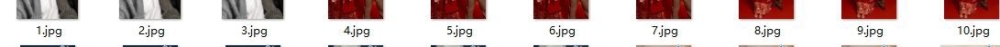

# 3D-CoolPhotoAlbum
很酷的3D相册展示（源码可共享，但图片禁止转载，谢谢）<br>
本项目是由某大佬制作的元素周期表修改而来的


### 1. 自动切换背景(带特效)
```bash
 \\过渡效果数组  "slideUp", "slideDown", "slideLeft", (这三个不建议加,会移除窗口)
	const transitionEffects = [
		"fade", "zoom", "slideRight", "blur", "zoomBlur", "rotate", "flipX", "flipY",
		"scaleUp", "scaleDown", "rotate360", "skewX", "skewY", "perspective", "pulse", "bounce", "shrink", "expand", "flash",
		"shake", "grow", "stretch", "twist", "bounceLeft", "bounceRight", "shakeX", "shakeY", "fadeIn", "fadeOut", "wobble",
		"glitch_infinite","Hypnotize","Rainbow_Glow","Shatter_Effect","Pixelate","Tilt_Shift","Ripple_Effect","Explosion_Effect","Swirl_Effect","Flicker_Effect"
	];
```

### 2. 注释掉 hideButtons 即可手动切换按钮
```bash
 hideButtons();
```

### 3. 照片路径
照片目录： ./images/small

名称格式： 1.jpg 2.jpg 3.jpg 


可在 ./js/index.js 进行修改
```bash
element.setAttribute('href', 'images/small/'+ (i/5 + 1)+'.jpg');
```
